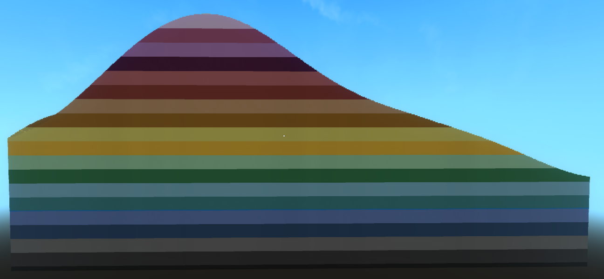

# 🌍 HytaleWorldGenV2 – Jakaya Tools

A versatile, **non-destructive toolkit** designed to help you build, debug, and refine Hytale worlds.

Built to be **drop-in ready**, these tools can be added to existing worlds with minimal setup no need to rebuild your pipeline.

---

## ✨ Features

- 🔧 Non-destructive – safely layer onto existing worldgen
- ⚡ Quick integration – plug into your current setup
- 🧪 Debug-friendly – visualize and test world data easily
- 🧱 Modular design – use only what you need

---

## 🧰 Current Tools

### 🎨 Colour Heightmap

Visualise terrain height using colour mapping. Perfect for debugging terrain shaping and elevation logic.



## 🚀 Usage

To use the heightmap tool, add an **Import Material Provider** node to your biome setup.

Set the provider to:

```json
Jakaya_Tools.Heightmap
```


## 📦 Installation

### 🔽 Download

1. Click the green **`Code`** button at the top of this repository
2. Select **Download ZIP**
3. Extract the contents to a location of your choice

---

### 📁 Install into Hytale

Copy the **`Server`** folder from this repository into your existing Hytale mod project.

Your final folder structure should look like this:

```json
Your Mod>/Server/HytaleGenerator/Biomes/Jakaya_Tools/
```

